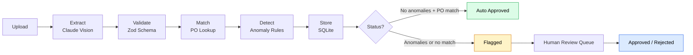
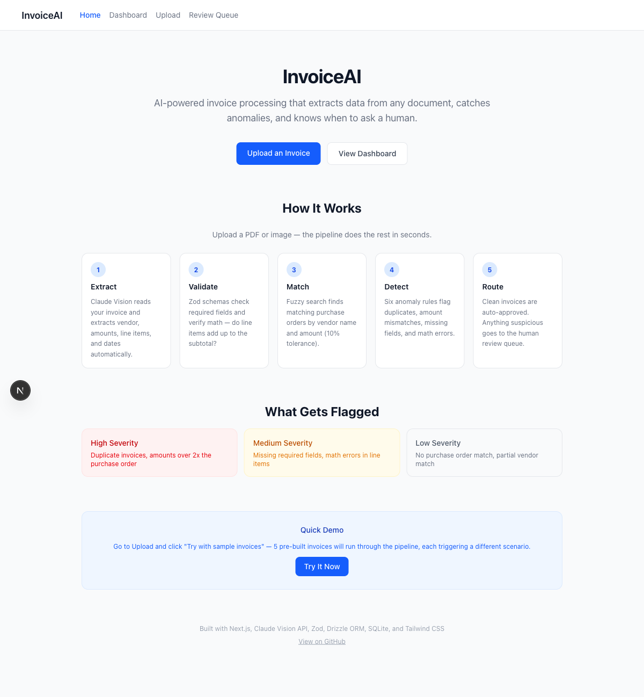
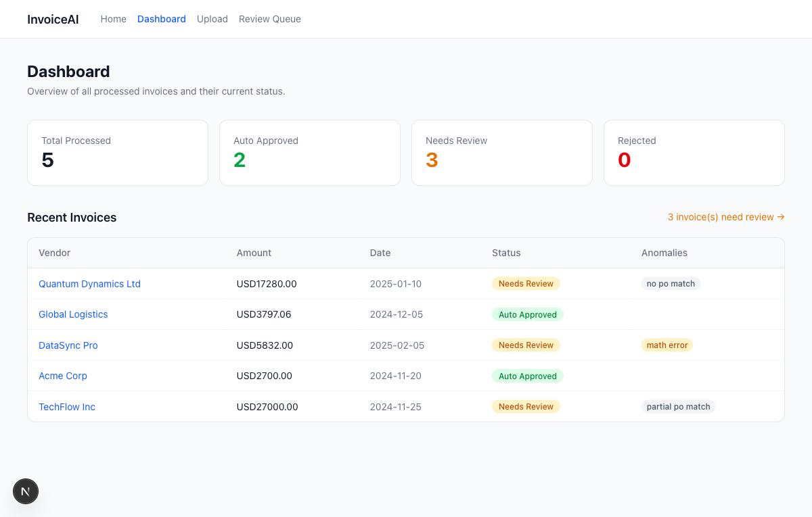
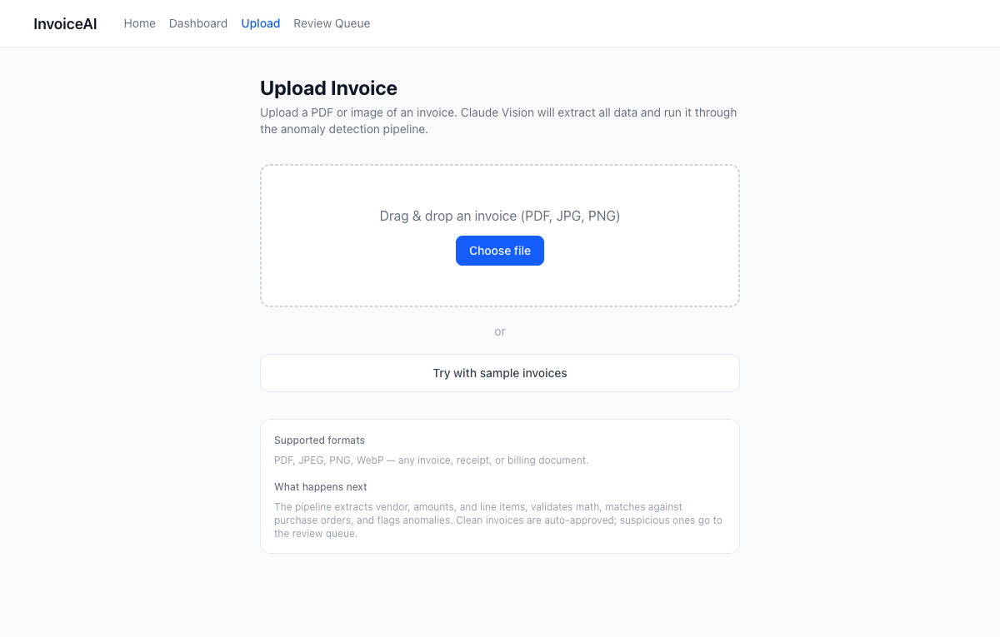
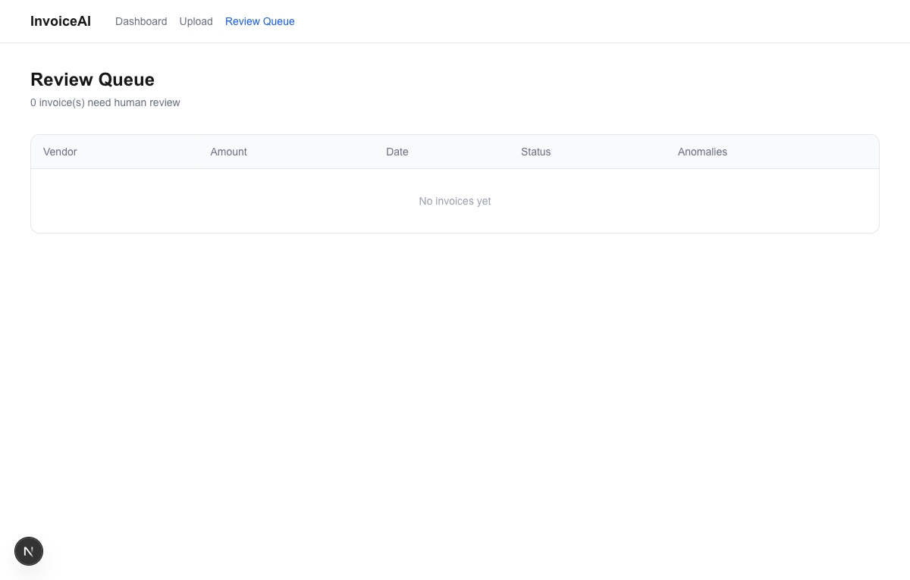
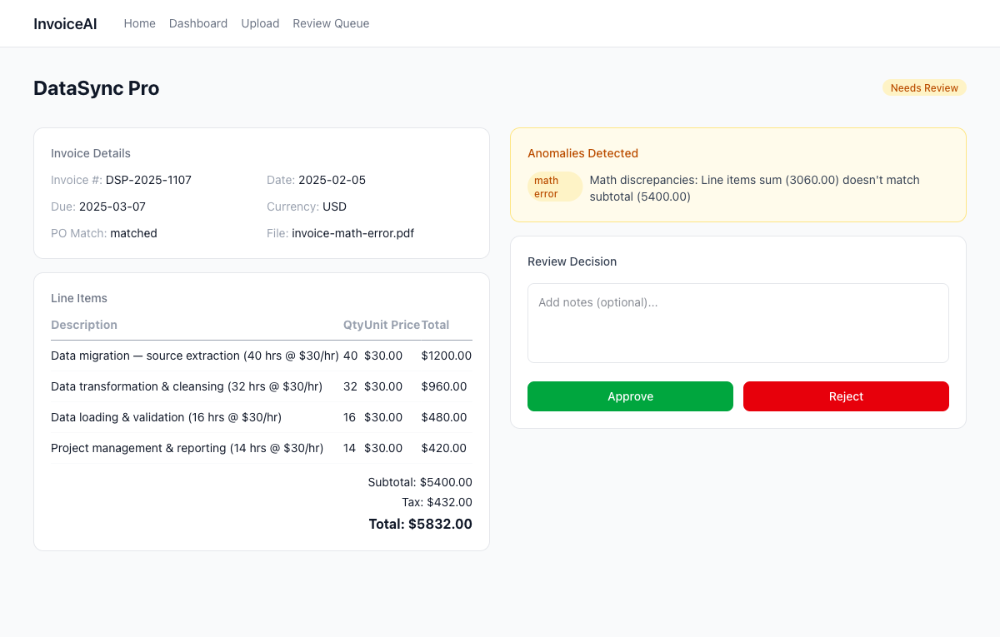

<p align="center">
  <h1 align="center">InvoiceAI</h1>
  <p align="center">
    AI-powered invoice processing with Claude Vision extraction, anomaly detection, and human-in-the-loop review queue.
  </p>
</p>

<p align="center">
  <a href="#quick-start">Quick Start</a> &middot;
  <a href="#architecture">Architecture</a> &middot;
  <a href="#features">Features</a> &middot;
  <a href="#screenshots">Screenshots</a> &middot;
  <a href="#contributing">Contributing</a>
</p>

<p align="center">
  
  
  
  
  
</p>

---

## The Problem

Finance teams still process invoices by hand. Someone opens a PDF, types numbers into a spreadsheet, checks them against a purchase order, and hopes they don't miss a duplicate or a $10k typo. It's slow, error-prone, and nobody enjoys it.

Full-auto AI extraction sounds great until it silently approves a fraudulent invoice or misreads a decimal point. You need automation that knows when to stop and ask a human.

## The Solution

InvoiceAI runs a 5-step pipeline that extracts, validates, matches, and flags invoices automatically -- then routes anything suspicious to a human review queue. It handles the boring 80% so your team can focus on the 20% that actually needs judgment.

**Three principles:**

1. **Extract with AI, validate with code.** Claude Vision reads the invoice; Zod schemas and math checks catch extraction errors before they propagate.
2. **Flag, don't guess.** When something looks off -- duplicate, amount mismatch, missing PO -- the invoice gets flagged for human review instead of auto-approved.
3. **Demo in 30 seconds.** Clone, install, run. Sample invoices are included so you see the full pipeline working immediately.

---

## Architecture



---

## Features

| Capability | What it does |
|------------|-------------|
| **Claude Vision extraction** | Structured data from any invoice format (PDF, image, scan) via a single API call |
| **Zod validation + math checks** | Catches extraction errors at the schema boundary, not downstream |
| **Fuzzy PO matching** | Tolerant vendor name matching against purchase order records |
| **6 anomaly detection rules** | Duplicate detection, amount variance, missing PO, suspicious line items, and more |
| **Human-in-the-loop review** | Flagged invoices surface in an in-app queue for approval or rejection |
| **Sample invoices** | Clone, run, and see the pipeline processing real data in under 30 seconds |

---

## Quick Start

```bash
git clone https://github.com/martin-minghetti/invoice-processor.git
cd invoice-processor
npm install
cp .env.example .env  # add your ANTHROPIC_API_KEY
npm run dev
# Open http://localhost:3000 and click "Try with sample invoices"
```

---

## Tech Stack

| Layer | Technology |
|-------|------------|
| Framework | Next.js 16 (App Router) |
| AI | Claude Vision API (Anthropic SDK) |
| Validation | Zod |
| Database | SQLite via Drizzle ORM |
| Testing | Vitest (~31 tests) |
| Styling | Tailwind CSS v4 |
| Deploy | Vercel |

---

## Testing

```bash
npm test
```

Runs ~31 unit tests covering the full pipeline: extraction schema validation, PO matching logic, anomaly detection rules, database operations, and end-to-end pipeline flow.

---

## Screenshots

| Home | Dashboard |
|------|-----------|
|  |  |

| Upload | Review Queue |
|--------|--------------|
|  |  |

| Invoice Detail |
|---------------|
|  |

---

## Project Structure

```
src/
  app/              # Next.js App Router pages and API routes
    api/             # REST endpoints (process, review, stats)
    dashboard/       # Processing dashboard
    invoices/[id]/   # Invoice detail view
    review/          # Human review queue
    upload/          # File upload page
  components/        # Shared UI components
  lib/
    db/              # Drizzle ORM schema, seed data
    pipeline/        # Core processing pipeline
      extract.ts     # Claude Vision extraction
      validate.ts    # Zod schema validation
      match.ts       # Fuzzy PO matching
      detect.ts      # Anomaly detection rules
      store.ts       # Database persistence
      process.ts     # Pipeline orchestrator
tests/               # Vitest test suite
samples/             # Sample invoices for demo
```

---

## Contributing

Contributions are welcome. Here's how to get started:

1. Fork the repo and create a feature branch
2. Make your changes
3. Run `npm test` and make sure all tests pass
4. Run `npm run lint` to check for style issues
5. Open a pull request with a clear description of what you changed and why

If you're adding a new anomaly detection rule or pipeline step, include tests that cover the new behavior.

---

## License

MIT -- see [LICENSE](LICENSE)
